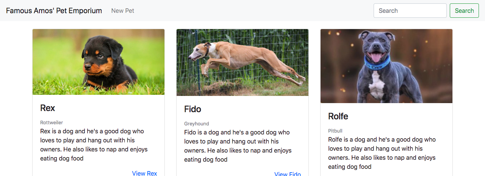

So now what if we wanted to search for a certain species of dog? or for the name of a dog we met last week? Let's search!

**Search** usually means you enter a search term and the server queries the database and responds with a subset of records and displays them.

Here we will be adding **Simple Search** meaning that we will be contacting the server with a request with a search term, the server will make a request using only a sort of **fuzzy keyword lookup** using **Regular Expressions** on one parameter. We will see there is a way to extend simple search to work for multiple parameters.

Chapter 7 will cover **Full Text Search**. Full text search allows you to search for multiple words across the whole text of a parameter (even a block of text) and any parameters with various search weights attached to each. MongoDB and other document-based databases ship with the ability to add full text search natively. SQL databases need a secondary service such as [Sphinx](http://sphinxsearch.com/) or [Apache Lucene](https://lucene.apache.org/) to achieve full text search.

# Make a Plan

No matter how small the feature is, it's always good to write out the steps you plan to take to implement a feature.

Let's code from the **Outside-In**, so we'll start with the views, then do the controllers, and finally use or extend the models and database.

1. Make a search form - one input field and button that submits a url structured like this `/search?term=poodle`
2. Make a `/search` route that responds with a template `pets-search.html` (we'll just reuse the `pets-index.pug` template)
3. Make the `/search` route actually search using our `Pet` model.
4. Write a test (if we were doing TDD (Test Driven Development) we'd start with this!)

# Search Form

Now we need a `pug` form in our header `navbar`.

So we can take the bootstrap 4 [navbar form](https://getbootstrap.com/docs/4.0/components/navbar/#forms) and plug it into a `jade/pug` => [HTML converter](http://html2jade.org/). And put this into the `nav` in the `layout.pug` file.

>[action]
> Update the `nav` in `layout.pug` to include the form:
>
```pug
nav.navbar.navbar-expand-sm.navbar-light.bg-light
...
    form.form-inline(action='/search')
      input.form-control.mr-sm-2(type='search', placeholder='Search', aria-label='Search' name='term')
      button.btn.btn-outline-success.my-2.my-sm-0(type='submit') Search
```

Make sure your homepage looks like this:



And when you submit it, the url should be formed like this:

```
http://localhost:3000/search?term=test
```

# Search Route

1. ~~Make a search form - one input field and button that submits a url structured like this `/search?term=poodle`~~
2. Make a `/search` route that responds with a template—we'll just reuse the `pets-index.pug` template.
3. Make the `/search` route actually search using our `Pet` model.
4. Write a test (if we were doing TDD (Test Driven Development) we'd start with this!)

>[action]
> Make the `/search` route in `routes/pets.js`, using the same `pets-index.pug` template.

```js
// SEARCH PET
app.get('/search', (req, res) => {
  res.render('pets-index', { pets: [0] });
});
```

# Simple Search Model Logic

1. ~~Make a search form - one input field and button that submits a url structured like this `/search?term=poodle`~~
2. ~~Make a `/search` route that responds with a template `pets-search.html` (we'll just reuse the `pets-index.pug` template)~~
3. Make the `/search` route actually search using our `Pet` model.
4. Write a test (if we were doing TDD (Test Driven Development) we'd start with this!)

Great, so now when we search, we have a results page, but now let's properly populate the page using the `Pet` model.

**Simple Search**, remember, means doing a **Fuzzy Keyword Lookup** on one parameter using **Regular Expressions**. So we are going to search *just on name*. To make it search, we're going to use the `i` modifier on a new Regular Expression to do **case-insensitive matching**.

>[action]
> Update `/routes/pets/search` to the following:
>
```js
// SEARCH PET
app.get('/search', (req, res) => {
  term = new RegExp(req.query.term, 'i')
>
  Pet.find({'name': term}).exec((err, pets) => {
    res.render('pets-index', { pets: pets });
  })
});
```

Open your browser and try searching for a dog's name.

# Searching for Name or Breed

What if we want to expand our search beyond just the name of the pet? Maybe you'd like to see every Poodle? Let's look at using the mongo `$or` condition to extend **simple search** to be able to search for *breed or name*.

> [action]
> Update `/routes/pets/search` to the following:
```js
// SEARCH PET
app.get('/search', (req, res) => {
  term = new RegExp(req.query.term, 'i')

  Pet.find({$or:[
    {'name': term},
    {'species': term}
  ]}).exec((err, pets) => {
    res.render('pets-index', { pets: pets });
  })
});
```

Open your browser and try searching for a dog's name or breed.

# Write a Test

1. ~~Make a search form - one input field and button that submits a url structured like this `/search?term=poodle`~~
2. ~~Make a `/search` route that responds with a template `pets-search.html` (we'll just reuse the `pets-index.pug` template)~~
3. ~~Make the `/search` route actually search using our `Pet` model.~~
4. Write a test (if we were doing TDD (Test Driven Development) we'd start with this!)

Now, in order to ship a feature to production, we need a test!

For a review of testing with `mocha` read this awesome guide by Michael Herman [Testing Node.js with Mocha and Chai](http://mherman.org/blog/2015/09/10/testing-node-js-with-mocha-and-chai/#.Ww3Xm1MvxTY)

Here is an example test we could write:

```js
// test-pets.js
...

// SEARCH
it('should search ALL pets by name on /search GET', (done) => {
  chai.request(server)
      .get('/search?term=norman')
      .end((err, res) => {
        res.should.have.status(200);
        res.should.be.html;
        done();
      });
});

...
```

The only problem with this test is that it doesn't really check if the search returns pets named "Norman". It just checks if the http status is 200, which it will be so long as there is no error, even if the search is not working. But at least we have some test coverage!

## Reference

[Excellent video by Ian Schoonover](https://www.youtube.com/watch?v=9_lKMTXVk64) to add search to your Rotten Potatoes project.

# Now Commit

```bash
git add .
git commit -m 'Users can search pets by name and breed'
git push
```
