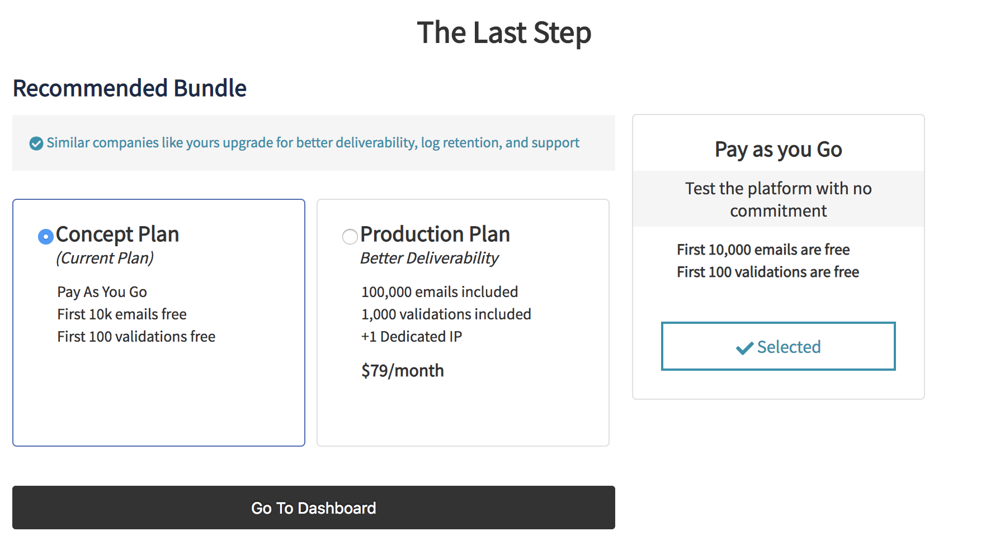
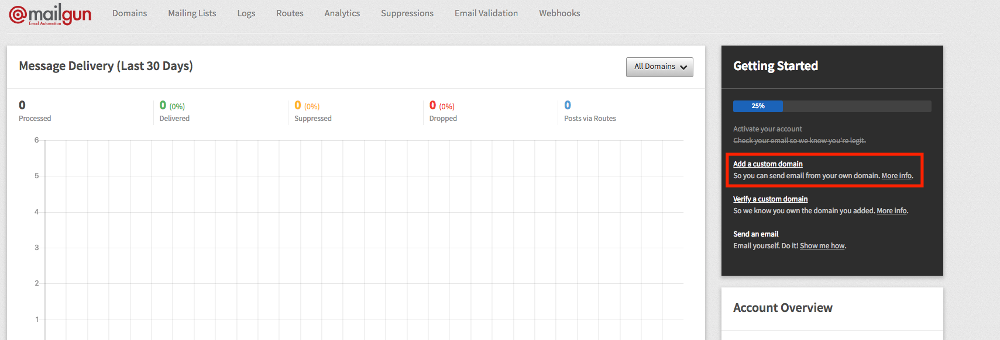
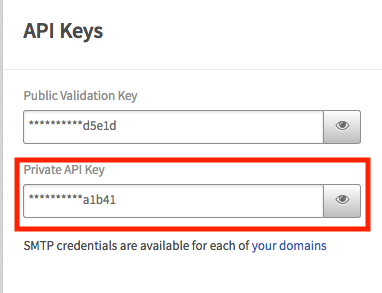

Sending emails is a common requirement of any web service. And as you might expect, Express.js and Node.js makes it quite easy to send emails!

You might use a gmail account for a minimum viable product, but gmail will only let you send ~500 emails per day. At that point you'll want a scalable option. [Mailgun](https://www.mailgun.com/) to the rescue!

Then we'll need to extend `nodemailer` with the [nodemailer-mailgun-transport](https://github.com/orliesaurus/nodemailer-mailgun-transport) because `nodemailer-mailgun-transport` uses `consolidate.js` under the hood to add support for templating engines.

This means we can use handlebars templates for rendering our emails!

# Make a Plan

First off we'll make a plan of the outside-in, step-by-step process to get emails firing off.

1. Install and configure the `nodemailer` and `nodemailer-mailgun-transport` modules.
1. Sign up for an account with [Mailgun](https://www.mailgun.com)
1. Add your email credentials to your `.env` file.
1. Send a sample email
1. Setup emails to send whenever a pet is sold.

# Installing and Configuring nodemailer and nodemailer-mailgun-transport

You know what to do:

>[action]
> Install the `nodemailer` and `nodemailer-mailgun-transport` modules
>
```bash
$ npm install nodemailer nodemailer-mailgun-transport --save
```
>
> Now update `server.js` to include these modules:
>
```js
// server.js
...
const nodemailer = require('nodemailer');
const mg = require('nodemailer-mailgun-transport');
...
>
const auth = {
  auth: {
    api_key: 'key-keyaldkjfadfasdfadsfadsf',
    domain: 'domain.com'
  }
}
>
const nodemailerMailgun = nodemailer.createTransport(mg(auth));
```

# Make a Mailgun Account & Add Credentials

1. Head over to [Mailgun](https://www.mailgun.com) and create an account by clicking the **Sign Up** button
1. Fill out the form with your information. Don't worry about the credit card number, you won't go over 10,000 emails
1. Select **Concept Plan**, then click **Go To Dashboard**

1. Check your email and verify your account, go through the verification code process
1. From the Dashboard, you should see a **Getting Started** box. After you finish activating your account, click on **Add a custom domain**

1. Enter a unique domain name and then click **Add Domain**. Now you have a domain! *Don't worry about verifying your domain for now.*

1. Finally, go back to the dashboard and scroll down. You should see an **API Keys** section. Find the **Private API Key** and copy that.


Now That you have both your **Private API key** and **domain**, let's add them to the project.

>[action]
> Add your Private API key and the  domain to your `.env` file. Replace the values with your actual MailGun API Key and Domain:
>
```
MAILGUN_API_KEY=mailgun-private-api-key
EMAIL_DOMAIN=mailgun-email-domain
```
>
> Now add those to your `auth` const in `server.js`

```js
const auth = {
  auth: {
    api_key: process.env.MAILGUN_API_KEY,
    domain: process.env.EMAIL_DOMAIN
  }
}
```

Now we are ready to try to send our first email.

# Sending Sample Email

Here's the code for sending an email with nodemailer transport:

> [action]
> Place this after your `nodemailerMailgun` declaration, remember to replace the `email` in `user` with your email so you can check it:
>
```js
// SEND EMAIL
const user = {
  email: 'YOUR@EMAIL.com',
  name: 'Emily',
  age: '43'
};
>
nodemailerMailgun.sendMail({
  from: 'no-reply@example.com',
  to: user.email, // An array if you have multiple recipients.
  subject: 'Hey you, awesome!',
  template: {
    name: 'email.handlebars',
    engine: 'handlebars',
    context: user
  }
}).then(info => {
  console.log('Response: ' + info);
}).catch(err => {
  console.log('Error: ' + err);
});
```

If you try and run that, it will probably throw an error because there is no `email.handlebars` template. Let's make that:

>[action]
> First install `handlebars`:
>
```bash
$ npm install handlebars express-handlebars --save
```
>
> Next in your root project folder, create an `email.handlebars` file and place the following code in it:
>
```html
<!doctype html>
<html lang="en">
<head>
    <meta charset="utf-8">
    <meta name="viewport" content="width=device-width, initial-scale=1, shrink-to-fit=no">
</head>
<body>
    <div class="container">
        <p>Hello World!</p>
    </div>
</body>
</html>
```

<!-- -->

> [info]
> Reminder: since `email.handlebars` will not inherit from a layout template, you will need the full html boilerplate.

Run your code by starting `nodemon` up and see if it sent a "hello world" email to yourself.

Once emails are sending, see if you can display the `user` name and age with handlebars variables.

>[solution]
>
> Updates to `email.handlebars`:
>
```html
<!doctype html>
<html lang="en">
<head>
    <meta charset="utf-8">
    <meta name="viewport" content="width=device-width, initial-scale=1, shrink-to-fit=no">
</head>
<body>
    <div class="container">
        <p>Hello {{name}}</p>
        <p>Your age is {{age}}</p>
    </div>
</body>
</html>
```

# Send an Email When Pets are Purchased.

Now we don't want to send emails just whenever we send our app! We want to send them when certain controller logic runs. For our Pet Store, there are a few places emails could go. When a pet is purchased, or when a pet is created. Let's do it as a notification when pets are purchased.

Move the email code so an email is sent to your email address whenever a pet is purchased.

>[action] move the `const` declarations from `server.js` to the top of `/routes/pets.js`:
>
```js
const nodemailer = require('nodemailer');
const mg = require('nodemailer-mailgun-transport');
>
const auth = {
  auth: {
    api_key: process.env.MAILGUN_API_KEY,
    domain: process.env.EMAIL_DOMAIN
  }
}
>
const nodemailerMailgun = nodemailer.createTransport(mg(auth));
```
>
> Now move your `nodemailer` code from `server.js` to your `/purchase` route in `/routes/pets.js`:
>
```js
// PURCHASE
  app.post('/pets/:id/purchase', (req, res) => {
    console.log(req.body);
    // Set your secret key: remember to change this to your live secret key in production
    // See your keys here: https://dashboard.stripe.com/account/apikeys
    var stripe = require("stripe")("sk_test_Loz6xPRc7Tl8c6OCkyZMAEkE");
>
    // Token is created using Checkout or Elements!
    // Get the payment token ID submitted by the form:
    const token = req.body.stripeToken; // Using Express
>
    Pet.findById(req.body.petId).exec((err, pet) => {
      if(err) {
        console.log('Error: ' + err);
        res.redirect(`/pets/${req.params.id}`);
      }
      const charge = stripe.charges.create({
        amount: pet.price * 100,
        currency: 'usd',
        description: `Purchased ${pet.name}, ${pet.species}`,
        source: token,
      }).then((chg) => {
      // Convert the amount back to dollars for ease in displaying in the template
        const user = {
          email: req.body.stripeEmail,
          amount: chg.amount / 100,
          petName: pet.name
        };
        // After we get the pet so we can grab it's name, then we send the email
        nodemailerMailgun.sendMail({
          from: 'no-reply@example.com',
          to: user.email, // An array if you have multiple recipients.
          subject: 'Pet Purchased!',
          template: {
            name: 'email.handlebars',
            engine: 'handlebars',
            context: user
          }
        }).then(info => {
          console.log('Response: ' + info);
          res.redirect(`/pets/${req.params.id}`);
        }).catch(err => {
          console.log('Error: ' + err);
          res.redirect(`/pets/${req.params.id}`);
        });
      })
        .catch(err => {
          console.log('Error: ' + err);
        });
    })
  });
```
>
> Finally, change your `email.handlebars` to something more reflective of a pet purchase. The below is just an example, but feel free to get creative:
>
```html
<!doctype html>
<html lang="en">
<head>
    <meta charset="utf-8">
    <meta name="viewport" content="width=device-width, initial-scale=1, shrink-to-fit=no">
</head>
<body>
    <div class="container">
        <p>Congrats on your new pet, {{petName}}!</p>
        <p>You Paid ${{amount}}</p>
        <p>Proud Pete's Pet Emporium thanks you!</p>
    </div>
</body>
</html>
```

Now test this by purchasing a pet. Did you get an email?

Great work! Let's commit and move forward!

# Now Commit

```bash
$ git add .
$ git commit -m 'Implemented Emails'
$ git push
```
